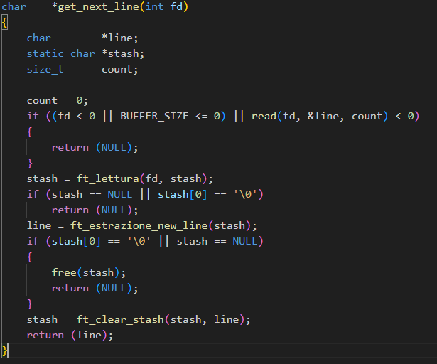
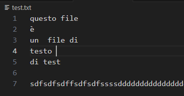
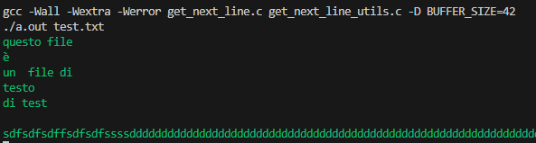

# Get_Next_Line (42 Firenze)

### Introduction

The function get_next_line reads a line of text from a file identified by the file descriptor fd ([ Subject ](./Docks/subject/GetNextLine.subject.pdf) )



### Testing 

- create a main under the get_next_line function and create a new text file

``` c

int main(int argc, char **argv)
{
    int     fd;
    char    *line;

    if (argc != 2)
    {
        return (1);
    }

    fd = open(argv[1], O_RDONLY);
    if (fd == -1)
    {
        perror("\033[31mError file \033[0m");
        return (1);
    }
    while ((line = get_next_line(fd)) != NULL)
    {
        printf("\033[32m%s\033[0m", line);
        free(line);
    }
    printf("\n");
    close(fd);
    return (0);
}

```



- open the terminal where the get_next_line.c file

``` bash
gcc -Wall -Wextra -Werror get_next_line.c get_next_line_utils.c -D BUFFER_SIZE=42
./a.out test.txt
```

## Output :

